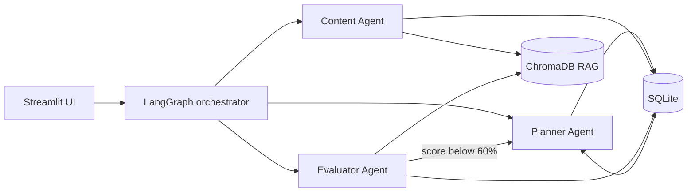

# StudyMate

> An adaptive AI study planner that turns course material and quiz results into a personalized learning loop.

StudyMate coordinates three focused agents to help a student **plan**, **learn**, **test**, and **replan**:

- **Planner Agent** creates and revises a day-by-day study schedule.
- **Content Agent** answers questions using RAG over the student's uploaded material.
- **Evaluator Agent** generates topic-focused MCQs, grades answers, and identifies weak areas.

The result is a closed loop rather than a one-off chatbot:

```text
Upload material -> Generate plan -> Study and ask doubts -> Take quiz
       ^                                                   |
       +---------------- Replan weak topics <-------------+
```

## Quick Navigation

| Start here | Explore deeper |
| --- | --- |
| [Quick start](#quick-start) | [Architecture](#architecture) |
| [Configuration](#configuration) | [Application workflow](#application-workflow) |
| [Run the app](#run-the-app) | [Programmatic API](#programmatic-api) |
| [Troubleshooting](#troubleshooting) | [Project structure](#project-structure) |

## Why StudyMate?

Traditional study planners are static, and generic chatbots do not connect explanations, assessment, and scheduling. StudyMate connects those activities through shared state:

1. Course material is indexed into a persistent ChromaDB collection.
2. The Planner Agent creates a schedule from extracted topics and available time.
3. The Content Agent answers questions with retrieved course context.
4. The Evaluator Agent measures topic-level understanding.
5. Low performance and repeated learning signals are shared with the Planner Agent.
6. The schedule is revised automatically when a topic's average score is below 60%.

## Features

- Upload a syllabus, textbook, or lecture-notes PDF.
- Extract topics and generate a day-wise study plan.
- Ask course-grounded questions with source and page metadata.
- Generate and grade topic-focused MCQ quizzes.
- Track topic performance, mastery levels, quiz history, and plan revisions.
- Share observations across agents through SQLite memory.
- Switch between Gemini, Groq, and local Ollama models.
- Use the Streamlit UI or call the workflow from Python.

## Tech Stack

| Layer | Technology |
| --- | --- |
| Orchestration | LangChain, LangGraph `StateGraph` |
| LLM providers | Google Gemini, Groq, Ollama |
| Embeddings | HuggingFace `sentence-transformers/all-MiniLM-L6-v2` |
| Vector search | ChromaDB |
| Database | SQLite |
| PDF ingestion | PyMuPDF |
| UI | Streamlit |
| Schemas and settings | Pydantic, `pydantic-settings` |

## Requirements

- Python 3.10 or newer. Python 3.12 is tested locally in this workspace.
- One LLM option:
  - Gemini API key: [Google AI Studio](https://aistudio.google.com/apikey)
  - Groq API key: [Groq Console](https://console.groq.com/keys)
  - Ollama: [Install Ollama](https://ollama.com/) for local inference
- Internet access on first run to download Python packages and the embedding model.

## Quick Start

### Windows PowerShell

```powershell
cd D:\StudyMate
python -m venv .venv
.\.venv\Scripts\Activate.ps1
python -m pip install --upgrade pip
pip install -r requirements.txt
Copy-Item .env.example .env
```

If PowerShell blocks activation for the current process:

```powershell
Set-ExecutionPolicy -Scope Process -ExecutionPolicy RemoteSigned
.\.venv\Scripts\Activate.ps1
```

### macOS or Linux

```bash
cd /path/to/StudyMate
python3 -m venv .venv
source .venv/bin/activate
python -m pip install --upgrade pip
pip install -r requirements.txt
cp .env.example .env
```

Next, configure a provider in `.env`, then [run the app](#run-the-app).

## Configuration

The complete template is in `.env.example`. The smallest Gemini-first setup is:

```dotenv
LLM_PROVIDER=auto
GEMINI_API_KEY=your-gemini-key
GROQ_API_KEY=your-groq-key
```

### Provider switching

Set `LLM_PROVIDER` to one of these values:

| Value | Behavior | Credentials |
| --- | --- | --- |
| `auto` | Gemini primary with alternate Gemini models and Groq fallback when configured | Gemini key; Groq key optional |
| `gemini` | Gemini direct mode, no fallback chain | `GEMINI_API_KEY` |
| `groq` | Groq direct mode, no fallback chain | `GROQ_API_KEY` |
| `ollama` | Local model through Ollama | No API key |

The active provider can also be changed from the Streamlit sidebar. Restarting the app is recommended after changing `.env`.

### Available settings

| Variable | Default | Purpose |
| --- | --- | --- |
| `LLM_PROVIDER` | `auto` | Provider mode |
| `GEMINI_API_KEY` | empty | Gemini credential |
| `GEMINI_MODEL` | `gemini-3.5-flash` | Gemini model name |
| `GROQ_API_KEY` | empty | Groq credential |
| `GROQ_MODEL` | `llama-3.3-70b-versatile` | Groq model name |
| `OLLAMA_BASE_URL` | `http://localhost:11434` | Ollama server URL |
| `OLLAMA_MODEL` | `qwen3:14b` | Local Ollama model |
| `HTTP_PROXY` | empty | Optional HTTP/HTTPS proxy |
| `LOG_LEVEL` | `INFO` | Application log level |

For Ollama:

```bash
ollama serve
ollama pull qwen3:14b
```

## Run the App

With the virtual environment activated:

```bash
streamlit run ui/app.py
```

Open [http://localhost:8501](http://localhost:8501).

### First session

1. Enter your name in the sidebar.
2. Open **Upload Syllabus**.
3. Enter a subject and upload a PDF.
4. Choose a number of study days or an exam date.
5. Select **Parse & Create Study Plan**.
6. Study from the generated plan, ask questions in **Ask Doubts**, and test topics in **Take Quiz**.
7. Review scores and agent observations in **Performance**.

The first run can take longer while the HuggingFace embedding model downloads and initializes.

## Application Workflow

### 1. Upload Syllabus

PyMuPDF extracts the PDF, the text splitter creates approximately 500-character chunks with 60-character overlap, and HuggingFace embeddings store those chunks in a persistent ChromaDB collection. An LLM extracts topics, then the Planner Agent creates the initial schedule.

### 2. Study Plan

The plan shows dates, topics, estimated hours, priorities, and completion controls. Completing a topic can suggest a quiz. Every generated revision increments the plan revision number.

### 3. Ask Doubts

The Content Agent searches the selected subject's vector collection and answers using the retrieved material. Source and page metadata are retained for citations. Questions are recorded as observations in shared agent memory.

### 4. Take Quiz

The Evaluator Agent retrieves material for a selected topic, generates MCQs, grades submitted answers, and records scores, weak areas, and quiz history.

### 5. Automatic Replanning

After grading, StudyMate checks topic averages. If any topic is below 60%, the Planner Agent receives the weak topics, performance data, and recent agent observations, then creates a revised schedule with additional revision priority.

### 6. Performance

The dashboard presents topic mastery, average scores, quiz count, score trends, plan revision, and cross-agent observations.

Mastery levels are calculated as:

| Level | Average score |
| --- | --- |
| Not Started | No attempts |
| Needs Work | Below 40% |
| Developing | 40% to 59% |
| Proficient | 60% to 79% |
| Mastered | 80% or higher |

## Architecture



The orchestrator dispatches actions and injects recent shared memory into agents. The main graph paths are:

| Action | Path |
| --- | --- |
| `ingest` | Parse PDF -> embed -> extract topics -> create plan -> save data |
| `ask_doubt` | Retrieve chunks -> Content Agent -> save observation |
| `generate_quiz` | Evaluator Agent -> return topic MCQs |
| `grade_quiz` | Grade answers -> update performance -> optionally replan |
| `replan` | Read performance and memory -> Planner Agent -> save revised plan |
| `view_plan` | Load the latest persisted plan |

For the full node topology, data flow diagrams, and database schema, see [docs/ARCHITECTURE.md](docs/ARCHITECTURE.md).

## Data and Persistence

Runtime data is stored locally:

```text
data/
├── vector_store/
│   └── ChromaDB persistent collections
└── studymate.db
```

SQLite stores `students`, `subjects`, `study_plans`, `topic_performance`, `quiz_results`, and `agent_memory`. ChromaDB stores one searchable collection per subject. Sample syllabus files are available in `data/`.

Do not commit API keys, private course material, generated databases, or vector-store data unless that is intentional.

## Programmatic API

The workflow entry points are exposed from `main.py`:

```python
from main import run_doubt, run_generate_quiz, run_ingest

run_ingest(
    syllabus_bytes=pdf_bytes,
    syllabus_filename="syllabus.pdf",
    student_id="student-1",
    subject="Data Structures",
    study_duration_days=14,
)

answer = run_doubt(
    question="Explain binary search tree insertion.",
    student_id="student-1",
    subject="Data Structures",
)

questions = run_generate_quiz(
    topic="Binary Search Trees",
    student_id="student-1",
    subject="Data Structures",
    num_questions=5,
)
```

Available helpers are `run_ingest`, `run_doubt`, `run_generate_quiz`, `run_grade_and_replan`, and `run_replan`. Each accepts an optional `on_step(node_name, status)` callback for progress reporting.

## Project Structure

```text
StudyMate/
├── agents/          # Planner, Content, and Evaluator agents
├── chains/          # LCEL chains such as topic extraction
├── data/            # Sample documents and runtime vector data
├── db/              # SQLite access layer
├── docs/            # Architecture and UI walkthrough
├── ingestion/       # PDF loading and ChromaDB operations
├── models/          # Pydantic schemas and graph state
├── tools/           # LangChain tools, including RAG search
├── ui/              # Streamlit application
├── config.py        # Settings and LLM provider factory
├── graph.py         # LangGraph workflow and nodes
├── main.py          # Programmatic workflow entry points
├── requirements.txt # Python dependencies
└── .env.example     # Configuration template
```

## Troubleshooting

| Symptom | Resolution |
| --- | --- |
| No course material is available | Upload a PDF in **Upload Syllabus** before asking questions or generating quizzes. |
| Gemini rate limit or `429` | Use `LLM_PROVIDER=auto` with `GROQ_API_KEY` configured, or switch to Groq/Ollama. |
| Ollama does not connect | Run `ollama serve`, verify `ollama list`, and check `OLLAMA_BASE_URL`. |
| Quiz generation returns no questions | Choose a topic present in the uploaded material or upload a richer PDF. |
| Embedding initialization is slow | The model downloads on first use; later runs use the local cache. |
| Corporate proxy or SSL errors | Set `HTTP_PROXY` in `.env` and restart the app. |
| PowerShell refuses activation | Use `Set-ExecutionPolicy -Scope Process -ExecutionPolicy RemoteSigned`. |

## Documentation

- [Architecture](docs/ARCHITECTURE.md): system layers, graph topology, data flow, and database design.
- [UI Walkthrough](docs/WALKTHROUGH.md): detailed setup and feature-by-feature usage.
- [Project Context](CONTEXT.md): goals, technology choices, and design decisions.

## Research Context

StudyMate is a research project exploring whether coordinated, specialized agents can provide more adaptive academic planning than a monolithic chatbot. The shared `agent_memory` table is central to that experiment: observations from content interactions and quizzes become context for future planning decisions.

## License

No license has been specified for this repository yet.