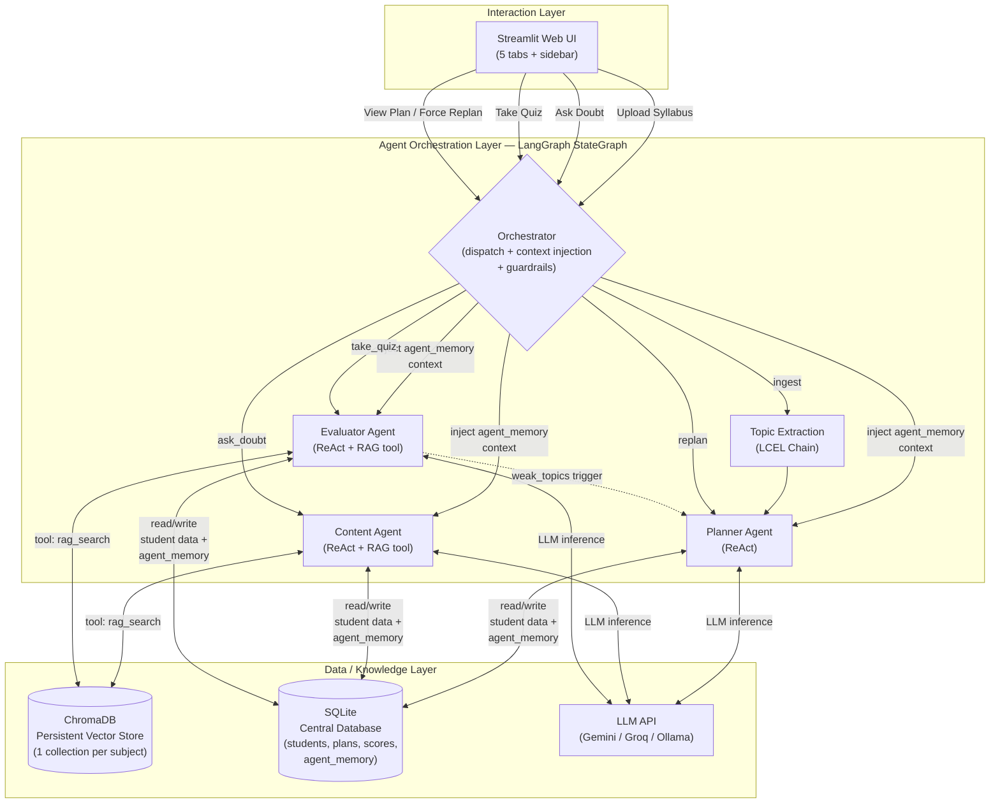
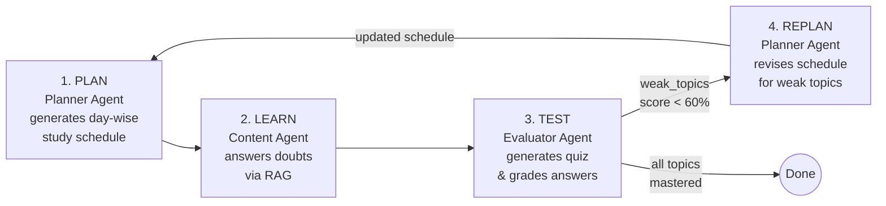
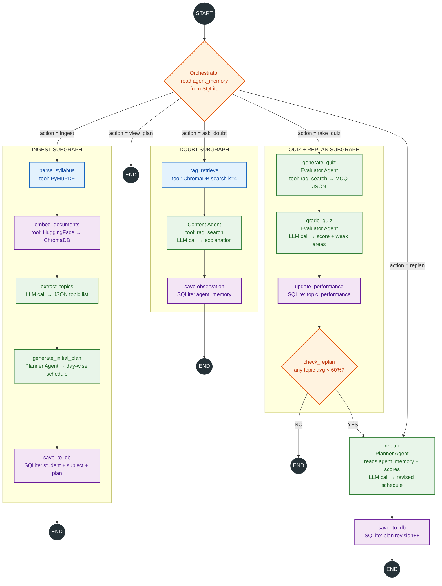
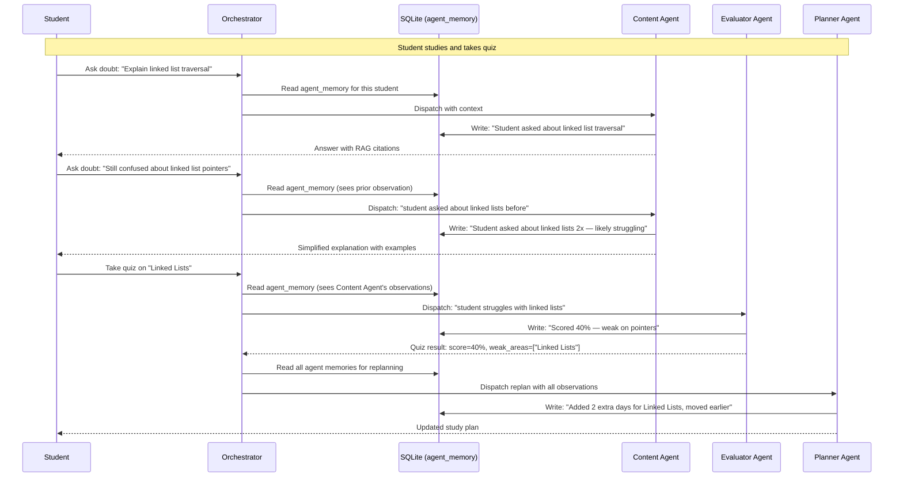
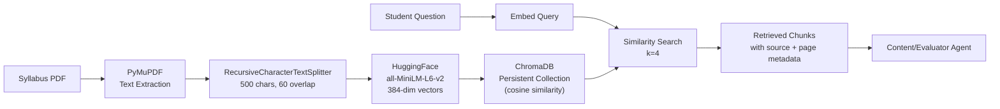

# StudyMate — System Architecture

## 1. Overview

StudyMate is a three-layer, multi-agent system for adaptive academic planning. Unlike monolithic AI chatbots, it uses specialized agents coordinated by an orchestrator, with a closed feedback loop that continuously adapts to student performance.

---

## 2. High-Level Architecture

### Layer Responsibilities

| Layer | Components | Purpose |
|-------|-----------|---------|
| **Interaction** | Streamlit UI (5 tabs + sidebar) | Student-facing interface: upload, plan, chat, quiz, dashboard |
| **Agent Orchestration** | LangGraph StateGraph + Orchestrator | Routes actions, coordinates agents, manages cross-agent context |
| **Data / Knowledge** | ChromaDB + SQLite + LLM API | Vector storage for RAG, relational storage for student data, LLM inference |

---

## 3. The Closed-Loop Flow

This is the core innovation — the Plan → Learn → Test → Replan cycle:

**What makes this different from existing systems:**

| Aspect | Existing Systems | StudyMate |
|--------|-----------------|------------|
| Planning | Static, one-time timetable | Planner Agent replans based on quiz results |
| Content | Generic search / single chatbot | Content Agent uses RAG grounded in student's own syllabus |
| Assessment | Separate, disconnected from planning | Evaluator Agent's results feed directly back to Planner |
| Architecture | Monolithic single-model chatbot | Coordinated multi-agent system with specialization |
| Adaptivity | None or coarse (weekly review) | Continuous, per-topic adaptivity after every quiz |

---

## 4. LangGraph StateGraph Topology

**Legend:** Blue = data processing, Green = LLM agent call, Orange = decision, Purple = data store read/write, Black = start/end

### Node Summary (13 nodes)

| Node | Type | LLM? | Description |
|------|------|------|-------------|
| `orchestrator` | Coordinator | No | Dispatches action, injects cross-agent memory |
| `parse_syllabus` | Data processing | No | PyMuPDF PDF extraction + chunking (500 chars, 60 overlap) |
| `embed_documents` | Data processing | No | Embed chunks into ChromaDB collection |
| `extract_topics` | LCEL Chain | Yes | Syllabus text → structured topic list (JSON) |
| `generate_initial_plan` | Planner Agent | Yes | Topics → day-wise study plan |
| `rag_retrieve` | Data processing | No | ChromaDB similarity search (k=4) |
| `content_agent` | ReAct Agent | Yes | RAG-grounded doubt answering |
| `generate_quiz` | Evaluator Agent | Yes | Topic → MCQ questions (JSON) |
| `grade_quiz` | Evaluator Agent | Yes | Answers → score + weak areas |
| `update_performance` | Pure Python | No | Update SQLite `topic_performance` table |
| `check_replan` | Pure Python | No | Check if weak topics warrant a replan |
| `replan` | Planner Agent | Yes | Current plan + weak topics + agent memories → revised plan |
| `save_ingest_to_db` | Pure Python | No | Persist ingest results to SQLite |

---

## 5. Cross-Agent Memory via SQLite

Agents coordinate through a shared `agent_memory` table in SQLite. Each agent reads observations from other agents and writes its own:

### Database Schema

| Table | Purpose |
|-------|---------|
| `students` | Student identity (id, name) |
| `subjects` | Subjects per student (name, ChromaDB collection, topics) |
| `study_plans` | Versioned day-wise plans (plan_data JSON, revision number) |
| `topic_performance` | Per-topic scores (best, average, attempts, mastery level) |
| `quiz_results` | Full quiz history (questions, answers, score, weak areas) |
| `agent_memory` | Cross-agent observations (agent_name, memory_type, content) |

---

## 6. Agent Specifications

### Planner Agent
- **Pattern:** `create_react_agent()` (LangGraph ReAct)
- **Tools:** None (receives structured data)
- **Temperature:** 0.3
- **Input:** Topic list + performance data + agent observations
- **Output:** JSON day-wise schedule with priorities

### Content Agent
- **Pattern:** `create_react_agent()` with RAG tool
- **Tools:** `rag_search` (ChromaDB)
- **Temperature:** 0.4
- **Input:** Student question + retrieved context + agent observations
- **Output:** Explanation with source citations

### Evaluator Agent
- **Pattern:** `create_react_agent()` with RAG tool
- **Tools:** `rag_search` (ChromaDB)
- **Temperature:** 0.2
- **Dual mode:** Generate quiz OR grade answers
- **Output:** MCQ questions (JSON) or grading results (JSON)

---

## 7. RAG Pipeline

---

## 8. Multi-Provider LLM Configuration

All agents and chains use `build_llm()` from `config.py`, which reads `LLM_PROVIDER` from `.env`:

| Provider | Model | Free Tier | Best For |
|----------|-------|-----------|----------|
| Gemini | `gemini-2.5-flash` | 15 RPM | Primary — best free model |
| Groq | `llama-3.3-70b-versatile` | 30 RPM | Fastest inference |
| Ollama | `qwen3:14b` | Unlimited | Offline / local development |

Switching providers requires no code changes — just update `LLM_PROVIDER` in `.env` or use the Streamlit sidebar dropdown.

---

## 9. Future Scope

### Orchestrator Guardrails
- Input validation (reject non-academic content)
- Content safety filtering
- Rate limiting for free-tier LLM APIs
- Prompt injection protection

### Advanced Adaptive Learning
- Spaced repetition (Ebbinghaus forgetting curve)
- Bloom's taxonomy quiz levels
- Learning style detection from interaction patterns

### Tiered LLM Routing
- Route tasks to models by complexity instead of using one model for everything
- **High tier** (Gemini 3.6/3.7 Flash): Planner Agent scheduling and replanning — requires complex multi-factor reasoning
- **Medium tier** (Gemini 3.5 Flash): Quiz generation and grading — needs accurate structured JSON
- **Low tier** (Groq/Flash-Lite): Topic extraction and doubt answering — mostly retrieval and summarization
- Saves premium model quota for genuinely hard tasks; becomes cost-saving on paid tiers

### Production Deployment
- PostgreSQL (replace SQLite for multi-user concurrency)
- Authentication (student login)
- LangFuse observability
- Cloud deployment with self-hosted LLM (vLLM/Ollama)

### Research Extensions
- A/B testing: adaptive vs. static plan
- Multi-LLM comparison study
- Longitudinal time-to-mastery tracking
